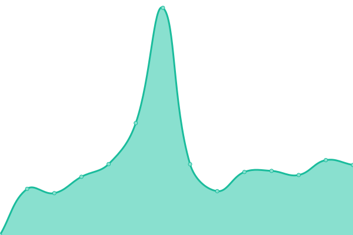

# 📈 Stato dei Servizi: <!--live status--> **🟩 Tutti i sistemi sono operativi**

<!--start: status pages-->
<!-- This summary is generated by Upptime (https://github.com/upptime/upptime) -->
<!-- Do not edit this manually, your changes will be overwritten -->
<!-- prettier-ignore -->
| URL | Status | History | Response Time | Uptime |
| --- | ------ | ------- | ------------- | ------ |
|  [Presidenza del Consiglio dei Ministri - OpenCup](https://www.opencup.gov.it/) | 🟩 Up | [presidenza-del-consiglio-dei-ministri-open-cup.yml](https://github.com/girolamodaschio/upptime/commits/HEAD/history/presidenza-del-consiglio-dei-ministri-open-cup.yml) | 

 3289ms
     
 | 

<a href="https://girolamodaschio.github.io/upptime/history/presidenza-del-consiglio-dei-ministri-open-cup">100.00%</a>
    

|  [Ministero Dei Trasporti - Portale OpenData](https://dati.mit.gov.it/catalog/dataset/scp) | 🟩 Up | [ministero-dei-trasporti-portale-open-data.yml](https://github.com/girolamodaschio/upptime/commits/HEAD/history/ministero-dei-trasporti-portale-open-data.yml) | 

 3616ms
     
 | 

<a href="https://girolamodaschio.github.io/upptime/history/ministero-dei-trasporti-portale-open-data">99.74%</a>
    

|  [Ragioneria Generale dello Stato - OpenBDAP](https://openbdap.rgs.mef.gov.it/) | 🟩 Up | [ragioneria-generale-dello-stato-open-bdap.yml](https://github.com/girolamodaschio/upptime/commits/HEAD/history/ragioneria-generale-dello-stato-open-bdap.yml) | 

 2084ms
     
 | 

<a href="https://girolamodaschio.github.io/upptime/history/ragioneria-generale-dello-stato-open-bdap">100.00%</a>
    

|  [ANAC - OpenData](https://dati.anticorruzione.it/opendata) | 🟩 Up | [anac-open-data.yml](https://github.com/girolamodaschio/upptime/commits/HEAD/history/anac-open-data.yml) | 

 1189ms
     
 | 

<a href="https://girolamodaschio.github.io/upptime/history/anac-open-data">100.00%</a>
    

|  [Portale Dati Bene Comune](https://www.datibenecomune.it) | 🟩 Up | [portale-dati-bene-comune.yml](https://github.com/girolamodaschio/upptime/commits/HEAD/history/portale-dati-bene-comune.yml) | 

 1235ms
     
 | 

<a href="https://girolamodaschio.github.io/upptime/history/portale-dati-bene-comune">100.00%</a>
    

<!--end: status pages-->

## 📄 Licenza

- Code: [MIT](./LICENSE) © [Upptime](https://upptime.js.org)
- Data in the `./history` directory: [Open Database License](https://opendatacommons.org/licenses/odbl/1-0/)
